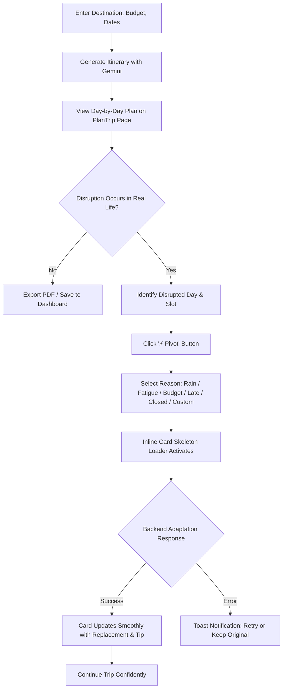

# TRIPNOW: ADAPTIVE AI TRAVEL PLANNER
## Product & UX Design Document (DESIGN.md)

**Document Version:** 1.0.0  
**Design Philosophy:** Fluid, Reassuring, Context-Aware, Uncluttered  
**Primary Page Context:** `frontend/src/pages/PlanTrip.jsx` & `frontend/src/pages/Dashboard.jsx`  
**Target Design System:** Warm Cream, Amber Gold, Deep Slate, High-Legibility Typography  

---

## 1. Design Principles

1. **Reassurance in the Face of Disruption:**
   Travel disruptions induce anxiety. The UI must feel calm, confident, and immediate. When plans fall apart in the real world, pivoting in TripNow must feel like having a seasoned local guide by your side.
2. **Surgical Focus (Zero Interface Shock):**
   Modifying an activity should never cause the entire page to blink, jump, or scroll to the top. Only the affected card should acknowledge the change, while the rest of the itinerary remains stable and reassuring.
3. **One-Tap Simplicity with Escape Hatches:**
   Common disruptions (rain, low energy, running late) must be accessible within two taps (⚡ Pivot $\rightarrow$ Reason). For unique situations, an uncluttered custom input provides instant flexibility.
4. **Honest System Transparency:**
   The UI must never pretend an unverified plan is flawless. When plans are generated, we show clear status. In future phases, the Reality Score transparently highlights tight connections or high-intensity days.

---

## 2. Brand Identity & Design System Tokens

The existing application establishes an editorial travel aesthetic leveraging Google Fonts, warm background tones, and distinct accent colors for times of day.

### 2.1 Color Palette
```css
:root {
  /* Surface & Canvas */
  --bg-canvas: #FDFBF7;           /* Warm creamy paper background */
  --surface-card: #FFFFFF;        /* Pure white elevated cards */
  --surface-subtle: #F8F6F0;      /* Slightly darker cream for inactive slots */
  --border-subtle: #EBE7DF;       /* Fine border separation */
  --border-focus: #D97706;        /* Warm gold active border */

  /* Typography */
  --text-primary: #1A1A1A;        /* Deep charcoal / off-black for crisp reading */
  --text-secondary: #6B7280;      /* Neutral gray for captions, subtitles, tips */
  --text-dim: #9CA3AF;            /* Muted helper text and placeholders */

  /* Brand Accents */
  --amber-primary: #D97706;       /* Warm travel gold */
  --amber-light: rgba(217, 119, 6, 0.1);
  --emerald-primary: #059669;     /* Nature, success, verified */
  --emerald-light: rgba(5, 150, 105, 0.1);
  --rose-primary: #E11D48;        /* Evening accent, alerts, disruptions */
  --rose-light: rgba(225, 29, 72, 0.1);
  --indigo-primary: #4F46E5;      /* Night, logistics, deep focus */

  /* Slot Accent Indicators */
  --slot-morning: #D97706;        /* Morning golden sun */
  --slot-afternoon: #059669;      /* Afternoon lush green */
  --slot-evening: #E11D48;        /* Evening sunset crimson */
}
```

### 2.2 Typography
- **Headings & Display:** `Playfair Display`, serif (700, 900) — Editorial, worldly, inspiring.
- **UI Labels & Navigation:** `Space Grotesk`, sans-serif (500, 600, 700) — Technical, modern, distinct.
- **Body & Prose:** `DM Sans` / `Inter`, sans-serif (400, 500, 600) — High legibility across mobile screens.

---

## 3. Information Architecture & Navigation

```
[TripNow Root]
  ├── Home Page (Hero, Destination Search, Quick Plan Presets)
  ├── PlanTrip (/plantrip) [PRIMARY WORKSPACE]
  │     ├── Left Sidebar (Trip Overview, Stats, Tab Navigation)
  │     │     ├── Days Count
  │     │     ├── Total Budget
  │     │     └── Navigation Tabs (Itinerary, Map, Budget, Food & Stays, Tips)
  │     └── Main Content Area
  │           ├── Header: Destination Title + Action Cluster (PDF, Edit, Save)
  │           ├── Reality Score Widget (Planned Phase 3)
  │           └── Tab Panels:
  │                 ├── [Tab: Itinerary] (Day Accordions -> Morning, Afternoon, Evening)
  │                 │     └── Activity Slot -> [⚡ Pivot Button] -> [Pivot Menu]
  │                 ├── [Tab: Map] (Interactive/Iframe Map of destination)
  │                 ├── [Tab: Budget] (Accommodation, Food, Transport breakdown)
  │                 ├── [Tab: Food & Stays] (Curated dining & hotels)
  │                 └── [Tab: Tips] (Local customs, transit advice)
  ├── Dashboard (/dashboard) (Saved Trips, History, Bookings)
  └── Shared Trip View (/bookings/shared/:id) (Read-only itinerary for travel companions)
```

---

## 4. Primary User Flows

### 4.1 End-to-End User Flow: The Adaptive Journey


---

## 5. Screen & Component Architecture: `PlanTrip.jsx`

### 5.1 Desktop Layout (Split View)
- **Left Column (Width: 320px, Sticky):**
  - Trip stats banner: Total Days, Total Budget, Season tag.
  - Tab Switcher: Vertical list of active sections (`Itinerary`, `Map`, `Budget`, `Food & Stays`, `Tips`).
- **Right Column (Main Canvas):**
  - **Header Bar:**
    - Destination title with stylish typography: *"Trip to Lisbon"*
    - Subtitle: *"Generated by AI · 3 Days · Tailored for Culture & Food"*
    - Action Cluster: `📄 Download PDF`, `✏️ Edit Trip`, `✈️ Save This Trip`.
  - **Main Itinerary View (Day Accordions):**
    - Each day has an expandable card header (`Day 1: Alfama & Historic Trams`).
    - Inside each day are 3 standardized slots:
      1. Morning (Golden accent)
      2. Afternoon (Emerald accent)
      3. Evening (Crimson accent, with optional Evening Eats badge)

---

## 6. Detailed UX Specification: The Adaptive Pivot Component

### 6.1 The Activity Slot Anatomy
Each period slot (Morning, Afternoon, Evening) is rendered inside `.day-slot`:

```
┌────────────────────────────────────────────────────────────────────────┐
│  ● AFTERNOON                                               [⚡ Pivot]  │
│  Explore the botanical gardens of Sintra and hike the high viewpoint. │
│                                                                        │
│  💡 Local Tip: Wear sturdy walking shoes for rocky paths.              │
└────────────────────────────────────────────────────────────────────────┘
```

### 6.2 Pivot Button & Trigger States
- **Default State:**
  - Compact pill button placed in the top-right of the slot header.
  - Label: `⚡ Pivot`
  - Style: Subtle amber border, semi-transparent background (`rgba(217, 119, 6, 0.08)`), text `#D97706`.
  - Hover: Background darkens to `rgba(217, 119, 6, 0.18)`, subtle scale transform (`1.02`).
- **Active / Open State:**
  - Background solid amber `#D97706`, text `#FFFFFF`.
- **In-Flight / Disabled State:**
  - Trigger is disabled (`pointer-events: none; opacity: 0.6;`).
  - Label switches to a mini spinner + `Adapting...`

### 6.3 The Pivot Menu (Popover / Dropdown)
When the user clicks `⚡ Pivot`, a floating popover opens immediately below the button:

```
┌──────────────────────────────────────────────┐
│  ⚡ What changed?                            │
│  ──────────────────────────────────────────  │
│  [ 🌧️ Rain ]        It's pouring / bad weather│
│  [ 🥱 Low Energy ]   Need something relaxing │
│  [ 💰 Budget ]       Prefer free or cheap    │
│  [ ⏰ Running Late ] Short on time / nearby  │
│  [ 🚫 Closed ]       Venue shut or sold out  │
│  [ ✏️ Other... ]     Custom situation        │
└──────────────────────────────────────────────┘
```

#### Micro-Interactions:
1. **Clicking a Preset (e.g. 🌧️ Rain):**
   - Popover closes immediately.
   - Request `POST /api/ai/pivot` fires.
   - The card transitions into the **Slot Skeleton State**.
2. **Clicking ✏️ Other...:**
   - The popover seamlessly expands downward with an inline input form:
     ```
     ┌──────────────────────────────────────────────┐
     │ ✏️ What changed?                             │
     │ [ Too hot outside, need air conditioning   ] │
     │ [ Cancel ]                   [ Adapt Now → ] │
     └──────────────────────────────────────────────┘
     ```
   - Hitting `Enter` or clicking `Adapt Now →` fires the request with `pivotReason: "custom"`.

### 6.4 In-Flight Loading State (Localized Skeleton)
While the backend validates and calls Gemini, **only the target slot** displays a pulsing loading state:

```
┌────────────────────────────────────────────────────────────────────────┐
│  ● AFTERNOON                                           [ ⏳ Adapting ] │
│  ██████████████████████████████████████████████                        │
│  ████████████████████████████████                                      │
│                                                                        │
│  [Finding weather-resilient alternatives nearby...]                    │
└────────────────────────────────────────────────────────────────────────┘
```
- Other days and sibling slots remain 100% interactive.
- Background pulse animation: `background: linear-gradient(90deg, #f0ede6 25%, #faf8f5 50%, #f0ede6 75%)`.

### 6.5 Success State & Transition
Upon receiving the HTTP 200 payload:
1. The skeleton fades out (`opacity: 0` in 150ms).
2. The new activity title, description, and metadata fade in with a gentle green flash (`#059669` border glow for 800ms).
3. A badge indicates the adapted reason:
   ```
   ┌────────────────────────────────────────────────────────────────────────┐
   │  ● AFTERNOON                             [ 🌧️ Adapted for Rain ] [⚡]  │
   │  Visit the National Tile Museum (Museu do Azulejo)                    │
   │  Housed in a 16th-century convent with intricate ceramic murals.       │
   │                                                                        │
   │  ✨ Why this works: 100% indoor, covered cloisters, great rainy vibe.   │
   │  💡 Insider Tip: The museum cafe serves traditional Portuguese tea.    │
   └────────────────────────────────────────────────────────────────────────┘
   ```

### 6.6 Error Handling & Rollback UX
If the backend returns an error (timeout, service unavailable, or invalid candidate after retry):
1. The skeleton disappears.
2. The original activity text is restored with zero data loss.
3. A toast banner slides in at the top right:
   `⚠️ Couldn't find a replacement right now. Your original plan was kept.`
4. The `⚡ Pivot` button re-enables with a `Try Again` tooltip.

---

## 7. Future UX Specifications (Phases 2 & 3)

### 7.1 Trip Reality Score Widget (Planned Phase 3)
Displayed prominently above the day tabs:

```
┌───────────────────────────────────────────────────────────────────────────────────────┐
│  TRIP REALITY SCORE: 88/100                                                [Details] │
│  [■■■■■■■■■■■■■■■■■■■■■■■■■■■■■■■■■■■■■■■■■■■■■■■■■■■■□□□□□□] High Feasibility       │
│                                                                                       │
│  ✓ Route Geometry: Excellent (Avg. transfer 18 mins)                                  │
│  ✓ Opening Hours: All verified open                                                   │
│  ⚠️ Pace Warning: Day 2 is high-intensity (7.2 km estimated walking)                  │
└───────────────────────────────────────────────────────────────────────────────────────┘
```
- **0–49 (Unrealistic):** Red banner; routes conflict or venues closed.
- **50–79 (Challenging):** Amber banner; tight connection windows.
- **80–100 (Realistic):** Emerald banner; optimal pacing and travel times.

### 7.2 Activity Locking (Planned Phase 2)
- Each activity card features a lock icon (`🔒` / `🔓`).
- When an activity is locked, global replanning or day pivots preserve that item as an immutable anchor and recalculate neighboring activities around it.

### 7.3 Fix My Day Experience (Phase 4)
- **Triggers**:
  - **Schedule Overload**: Actionable button `[ ⚡ Fix Day X ]` in the Reality Score Banner/Drawer when `daily_overload` or `slot_overrun` is detected.
  - **Running Late**: Dedicated action button in the day header opening a prompt for `currentPeriod` (`morning` | `afternoon` | `evening`) and delay slider (`delayMinutes` $\in [15, 240]$).
- **Diff Preview Modal (`FixDayModal.jsx`)**: Non-destructive preview presenting exact before/after state:
  - **Completed Past Slots (`COMPLETED PAST`)**: Prior periods marked immutable with dim styling; counts scheduled active time toward daily total without inventing elapsed progress.
  - **Current Period (`IN_PROGRESS`)**: The in-progress `currentPeriod` activity is strictly immutable in Phase 4 MVP regardless of lock state.
  - **Locked Anchors (`🔒 ANCHOR KEPT`)**: Highlighted with amber anchor badge, showing all 10 fields and duration preserved intact.
  - **Targeted Replacements (`REPLACED`)**: For periods with single or multiple activities, diff explicitly maps to the exact `targetActivityId`, displaying original vs replacement with reason tag. Non-target activities remain untouched.
  - **Score & Pacing Impact Banner**: Live delta display: e.g. `Trip Reality Score: 64 (Risky) → 86 (Excellent) (+22 pts)` and `Daily Active Time: 10.3h → 7.0h (-3.3h)`.
- **Feasibility Feedback**:
  - If unavoidable scheduled duration exceeds allowable capacity, surfaces pre-flight warning: *"Remaining day capacity cannot absorb this delay."* (HTTP 422).
  - If AI candidate fails verification after corrective retry, surfaces: *"Could not find an alternative that resolves the schedule overload. Please adjust activities manually."* (HTTP 502).
- **Explicit Confirmation**: Action button `[ ✅ Apply Fix to Day X ]` transmits stateless `proposalToken` (binding targetActivityId, reason, currentPeriod, delayMinutes, and baseVersion); `[ Keep Original Plan ]` dismisses modal with zero state changes.

---

## 8. Responsive & Mobile Design

### 8.1 Mobile Viewport ($\le 768\text{px}$)
- **Sidebar collapse:** The 320px sticky sidebar collapses into a horizontal scrollable tab bar fixed below the mobile navigation header.
- **Touch Targets:** All buttons (`⚡ Pivot`, accordion headers, tab pills) have a minimum tap target of $44 \times 44\text{px}$.
- **Pivot Sheet:** On mobile, the pivot popover renders as a smooth bottom sheet (drawer) sliding up from the bottom of the screen, providing ample thumb zone room.

---

## 9. Accessibility (a11y) Standards

- **Color Contrast:** All text tokens meet WCAG 2.1 AA contrast ratio ($\ge 4.5:1$ against backgrounds).
- **Keyboard Navigation:**
  - Accordion headers support `Enter` and `Space` for expanding/collapsing.
  - Pivot menu supports `ArrowUp` / `ArrowDown` and `Escape` to close.
- **Screen Reader Announcements (`aria-live`):**
  - Slot loading state announces: *"Adapting Day [X] [Slot] for [Reason]..."*
  - Slot completion announces: *"Day [X] [Slot] updated with new activity: [Title]."*
