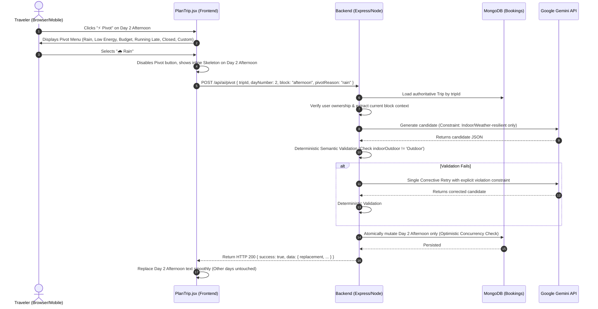

# TRIPNOW: ADAPTIVE AI TRAVEL PLANNER
## Product Requirements Document (PRD)

**Document Version:** 1.0.0  
**Status:** Approved for Implementation (Phase 1)  
**Product Philosophy:** PLAN → VERIFY → ADAPT  
**Author:** Senior Full-Stack Engineering & Product Architecture Team  

---

## 1. Executive Summary

TripNow is an intelligent, adaptive travel companion that bridges the gap between probabilistic AI creativity and deterministic real-world travel execution.

Traditional AI travel tools generate static, brittle itineraries. When reality inevitably intervenes—sudden tropical rain, severe fatigue, closed monuments, budget overruns, or delayed transport—the static itinerary collapses, leaving travelers stranded with a useless plan.

TripNow redefines AI travel around a three-stage lifecycle:
1. **PLAN:** Generate bespoke, culturally rich travel plans tailored to traveler preferences, budget, and dates using Google Gemini.
2. **VERIFY (Future Engine):** Validate the itinerary deterministically against physical reality—geographic feasibility, travel times, opening hours, budget realism, and physical pace.
3. **ADAPT (Phase 1 Focus):** Empower travelers to dynamically pivot any single itinerary block or activity on the fly with a single tap, recalculating options based on live disruptions without destroying the rest of their trip.

---

## 2. Problem Statement

### 2.1 The "Brittle Itinerary" Syndrome
Generative AI excels at brainstorming tourist sights, but LLM-generated travel plans are notoriously brittle:
- **Zero Real-Time Resilience:** If it rains on Day 2 afternoon, an itinerary sending the traveler to an open-air beach is ruined. The traveler must either abandon the tool or regenerate the entire multi-day trip from scratch, losing all other planned days.
- **Context Oblivion:** Travelers encounter sudden energy slumps, unexpected expenses, or venue closures. Existing tools provide no granular, in-place adaptation.
- **The "Hallucination Trap":** Static AI tools frequently generate physically impossible days—placing two attractions 6 hours apart into the same afternoon or recommending closed venues.
- **All-or-Nothing Regeneration:** Prior to TripNow, modifying a single activity meant regenerating the entire document, overwriting days the traveler had already confirmed or booked.

---

## 3. Product Vision & Core Tenets

### 3.1 The Product Formula
$$\text{PLAN (Generative AI)} \longrightarrow \text{VERIFY (Deterministic Engine)} \longrightarrow \text{ADAPT (Adaptive Pivot Engine)}$$

### 3.2 Core Tenets
1. **Probabilistic Brain vs. Deterministic Brain:**
   - **Google Gemini** is the creative, probabilistic engine. It suggests alternatives, writes descriptions, and crafts experiences.
   - **The TripNow Backend** is the authoritative, deterministic brain. It governs authentication, trip ownership, data persistence, schema validation, physical constraints, and concurrency protection. Gemini *never* directly writes to the database.
2. **Surgical Precision (Zero Collateral Damage):**
   - Adapting one block (e.g., Day 2 afternoon) must never alter Day 1, Day 2 morning, Day 3, or stored user preferences.
3. **Zero Trust Client Architecture:**
   - The frontend client never dictates authoritative trip state, budget totals, or user permissions. The backend loads the ground truth from MongoDB and enforces strict access control.
4. **Resilience over Failure:**
   - When Gemini generates an invalid recommendation (e.g., proposing an outdoor water park during a "Rain" pivot), the system catches the violation deterministically and executes a corrective retry before the user ever sees an error.

---

## 4. Target User Personas

### Persona A: The Time-Constrained Solo Adventurer ("Maya", 29)
- **Profile:** Digital nomad / fast-paced professional taking a 4-day trip to Tokyo.
- **Pain Point:** Running 90 minutes late due to a train delay; needs an instant afternoon replacement near Shibuya without re-planning the evening dinner in Shinjuku.
- **TripNow Value:** Hits **⚡ Pivot → ⏰ Running Late**, instantly receiving a compact, nearby replacement that fits the remaining window.

### Persona B: The Budget-Conscious Duo ("Liam & Chloe", 24)
- **Profile:** Backpackers traveling Southeast Asia on a strict ₹3,000/day combined allowance.
- **Pain Point:** Realize by midday that lunch cost more than anticipated; need free or low-cost afternoon activities.
- **TripNow Value:** Hits **⚡ Pivot → 💰 Budget**, receiving zero-cost scenic walks, local temple grounds, or free public galleries.

### Persona C: The Family Vacationer ("Vikram", 41)
- **Profile:** Traveling with two children and elderly parents in Goa.
- **Pain Point:** Sudden monsoon downpour washes out the planned beach excursion; family energy is dropping rapidly.
- **TripNow Value:** Hits **⚡ Pivot → 🌧️ Rain** (or **🥱 Low Energy**), receiving weather-resilient, indoor, seated cultural workshops or spice plantation covered dining.

---

## 5. User Journeys & Workflows

### 5.1 Journey 1: Primary Trip Generation (PLAN)
1. **Input:** Traveler visits TripNow (`/plantrip`), selects destination (e.g., "Kyoto"), budget (e.g., "₹45,000"), and travel dates.
2. **Generation:** Frontend calls `POST /api/ai`. Backend orchestrates prompt assembly with Google Gemini (`gemini-3.6-flash`).
3. **Persistence:** Backend validates JSON adherence, saves the trip into MongoDB (`Booking` collection), and returns the generated plan and `tripId`.
4. **Rendering:** Frontend renders the day-by-day accordion (Morning, Afternoon, Evening, Food, Stays, Budget Breakdown).

### 5.2 Journey 2: In-Trip Disruption & Surgical Adaptation (ADAPT — Phase 1)

---

## 6. Functional Requirements

### 6.1 Phase 1: Adaptive Pivot Engine (Current Scope)

| Feature ID | Feature Name | Description | Priority |
| :--- | :--- | :--- | :--- |
| **FR-101** | Block-Level Pivot Endpoint | Dedicated `POST /api/ai/pivot` accepting `tripId`, `dayNumber`, `block`, `pivotReason`, `customReason`. | P0 (Must Have) |
| **FR-102** | Zero-Trust Backend Auth | Validate session/token and ensure authenticated user owns the target trip before any processing. | P0 (Must Have) |
| **FR-103** | Server-Side State Loading | Read destination, dates, budget, and neighbor blocks strictly from MongoDB; reject client state override. | P0 (Must Have) |
| **FR-104** | Standardized Pivot Reasons | Support 6 core triggers: `rain`, `low_energy`, `budget`, `running_late`, `closed`, `custom`. | P0 (Must Have) |
| **FR-105** | Structured Gemini Integration | Use official `@google/genai` SDK with `responseMimeType: "application/json"` and strict schema. | P0 (Must Have) |
| **FR-106** | Defensive Semantic Validation | Programmatically check that Gemini replacements obey the constraint (e.g. Rain $\rightarrow$ not Outdoor). | P0 (Must Have) |
| **FR-107** | Single Corrective Retry | If validation fails, perform exactly one retry with prompt feedback; return clean 502 if second attempt fails. | P0 (Must Have) |
| **FR-108** | Surgical Mutation | Mutate *only* the targeted block in the target day; leave all other blocks, days, tips, and budget untouched. | P0 (Must Have) |
| **FR-109** | Concurrency Protection | Prevent race conditions and double clicks via frontend button locking and MongoDB versioning (`__v`). | P0 (Must Have) |
| **FR-110** | Backward Compatibility | Keep `POST /api/ai` contract completely unchanged; pass all 38 existing automated tests. | P0 (Must Have) |
| **FR-111** | Inline UI Pivot Experience | Add compact Pivot triggers to `PlanTrip.jsx` with card-level loading states and graceful error fallback. | P0 (Must Have) |

### 6.2 Phase 2: Structured Activities & Locking (Planned)
- **FR-201 (Activity Schema Migration):** Transition from prose strings (`morning`, `afternoon`) to discrete activity entities with IDs, start times, durations, and category tags.
- **FR-202 (Pin/Lock Activity):** Travelers can "Lock" specific activities (e.g., pre-booked dinner) so global or multi-block pivots route around them.
- **FR-203 (Vibe Palette):** Granular vibe tags (Relaxed, High Energy, Romantic, Kid-Friendly, Hidden Gems) applied to entire trips or individual days.

### 6.3 Phase 3: Reality Engine & Score (Planned)
- **FR-301 (Trip Reality Score):** 0–100 deterministic feasibility metric scoring route efficiency, pacing, opening hours, and budget realism.
- **FR-302 (Deterministic Route & Time Check):** Verify travel duration between stops using geographic coordinates and transit matrix APIs.
- **FR-303 (Operating Hours Verification):** Flag conflicts where an activity is scheduled outside verified opening hours.

### 6.4 Phase 4: Adaptive Day Replanning — Fix My Day (Hardened Specification)
- **FR-401 (Schedule Compaction & Running-Late State):** Multi-slot day adaptation resolving schedule overload (> 540m active time) or cascaded delays (`running_late` requiring explicit `currentPeriod: "morning" | "afternoon" | "evening"` and `delayMinutes` $\in [15, 240]$). Periods prior to `currentPeriod` are immutable past (`COMPLETED_PAST`); `currentPeriod` is immutable in Phase 4 MVP regardless of lock state; only eligible upcoming unlocked periods after `currentPeriod` may be adapted. Allowable future active minutes is calculated deterministically server-side: $\text{HardCeiling} (480\text{m}) - \text{delayMinutes} - \sum \text{PastScheduledActiveMinutes} - \text{CurrentScheduledActiveMinutes}$. System evaluates scheduled durations and never invents or assumes elapsed progress. Pre-flight returns HTTP 422 (`FUTURE_CAPACITY_INSUFFICIENT`) if unavoidable future/locked scheduled duration deterministically exceeds allowable capacity or zero eligible replacement targets exist. If a generated Gemini candidate fails verification after corrective retry, returns HTTP 502 (`PROPOSAL_VALIDATION_FAILED`) without asserting mathematical impossibility.
- **FR-402 (Cryptographic Proposal Integrity & Exact Activity Targeting):** Two-step preview-and-apply workflow (`POST /api/ai/fix-day/preview` and `POST /api/ai/fix-day/apply`). Signed with dedicated server secret `FIX_DAY_PROPOSAL_SECRET` via HMAC-SHA256. The signed token cryptographically binds the complete context: `purpose: "fix-day"`, `proposalId` (UUID v4), `tripId`, `dayNumber`, `baseVersion`, `reason`, `currentPeriod`, `delayMinutes`, `replacementSlots`, `issuedAt`, and `expiresAt` ($\text{expiresAt} > \text{issuedAt}$ and $\text{expiresAt} - \text{issuedAt} \le 900000$). Every replacement in `replacementSlots` explicitly binds `targetActivityId` and the replacement activity. `targetActivityId` must exist on the requested day, be unlocked, and belong to an eligible future period for `running_late`. The replacement inherits `id = targetActivityId` and `period = targetPeriod`. Gemini never invents activity IDs, activity count cannot increase, and missing periods cannot be created. The apply endpoint verifies all signed claims before database lookup or OCC comparison; client cannot alter reason, currentPeriod, delayMinutes, baseVersion, or replacement content.
- **FR-403 (Deep Bit-for-Bit Locked Immutability):** Locked activities are verified deeply equal across all 10 canonical fields (`id`, `period`, `title`, `description`, `category`, `durationMinutes`, `cost`, `indoorOutdoor`, `location`, `locked`). Zero fields or metadata may change. If all slots on a day are locked, adaptation is rejected with HTTP 422.
- **FR-404 (Category Contract Inheritance):** Reuses the full Phase 2 StructuredActivity category enum: `["Sightseeing", "Culture", "Adventure", "Dining & Nightlife", "Relaxation", "Nature", "Shopping"]`.
- **FR-405 (Deterministic Budget Policy):** Evaluates known numeric costs without inventing numbers for unknown prose ("Moderate"). Allows existing trip budget deficits to remain without penalty, but strictly rejects candidates that introduce a new deficit or worsen an existing deficit.
- **FR-406 (Deterministic Verification & Zero AI Arithmetic):** Gemini proposes candidates strictly within server-calculated slot ceilings. Phase 3 Reality Engine verifies the simulated day before preview and again before atomic OCC mutation. Zero AI arithmetic.

---

## 7. Non-Functional Requirements (NFRs)

### 7.1 Performance & Latency
- **Pivot Response Time:** Total round-trip latency for `POST /api/ai/pivot` $\le 3.5\text{ seconds}$ on initial attempt; $\le 6.5\text{ seconds}$ in the event of a defensive retry.
- **Frontend Perceived Latency:** Immediate UI feedback ($\le 50\text{ ms}$) showing localized card skeleton loader upon pivot selection.
- **Payload Size:** REST payloads under 15 KB to guarantee ultra-fast mobile network transfers.

### 7.2 Security & Compliance
- **Zero API Key Leakage:** `GEMINI_API_KEY`, `JWT_SECRET`, and database connection URIs must never be sent to the client, logged in build output, or committed to Git.
- **Server-Side Authoritative Verification:** Client input must be validated with Zod/Joi schemas. Malformed or unrecognized enum values must return HTTP 400 immediately.
- **OWASP Top 10 Adherence:** Rate limiting on AI endpoints (`aiLimiter`), sanitized prompts against prompt injection, strict CORS policies, and HTTP header hardening via Helmet/Security middleware.

### 7.3 Reliability & Availability
- **Graceful Upstream Handling:** If Google Gemini experiences upstream rate limits (HTTP 429) or service degradation (HTTP 503/504), return clear, friendly error messages without crashing the server process.
- **Atomic Operations:** Mongo mutations must be atomic; no partial or corrupted document states allowed.
- **Deterministic Testability:** 100% of CI automated test suite must run without calling live external AI APIs using mock GenAI boundaries.

---

## 8. Current vs. Planned Scope Matrix

| Dimension | Current Baseline (Existing Codebase) | Phase 1 (Adaptive Pivot MVP) | Future Roadmap (Phases 2–4) |
| :--- | :--- | :--- | :--- |
| **Generation (`POST /api/ai`)** | Google Gemini (`gemini-3.6-flash`), Structured JSON | Preserved 100% as-is, unchanged contract | Enhanced with Vibe Palette & multi-modal inputs |
| **Adaptation (`POST /api/ai/pivot`)** | Non-existent (requires full trip re-generation) | Fully implemented: 6 semantic pivot reasons | Multi-block pivot, Day-level pivot ("Fix My Day") |
| **Itinerary Schema** | String blocks (`morning`, `afternoon`, `evening`) in `Booking.aiPlan` | Operates at block-level on existing schema | Structured `activities[]` array with IDs & coords |
| **Verification & Scoring** | None (pure LLM output) | Deterministic semantic constraint checks | Reality Score (0–100), Route & Time feasibility |
| **Trip Locking** | Not supported | Not supported | Lock individual activities against mutation |
| **Real-time Context** | Static user inputs | User-initiated semantic triggers | Auto-weather triggers, live transit integration |
| **Concurrency** | Unprotected simultaneous writes | Frontend button lock + Mongoose version check | Distributed Redis locks / message queues |

---

## 9. Success Metrics & Key Performance Indicators (KPIs)

1. **Pivot Adoption Rate:** $> 35\%$ of generated trips utilize the Pivot feature at least once.
2. **Pivot Latency:** Median (p50) server processing time $< 2.2\text{s}$, 95th percentile (p95) $< 4.8\text{s}$.
3. **Semantic Retry Success Rate:** $> 92\%$ of first-attempt constraint violations successfully resolve on the single corrective retry.
4. **Trip Retention / Save Rate:** $+25\%$ increase in trips saved to `/dashboard` following successful pivot interactions.
5. **Zero Regression Guarantee:** 100% pass rate on all 38 existing baseline tests plus 100% pass rate on new pivot test suites.

---

## 10. Acceptance Criteria (Phase 1 Definition of Done)

- [ ] `POST /api/ai/pivot` is live and registered under `/api/ai` router.
- [ ] Existing `POST /api/ai` functionality and response schema remain 100% backward compatible.
- [ ] 38/38 existing Jest tests continue passing without modification.
- [ ] New comprehensive test suite covers all 6 pivot reasons, malformed inputs, unauthorized access, retry triggers, and concurrency rejections.
- [ ] Pivot modifies *only* the designated day and block; all adjacent days, blocks, and tips remain bit-for-bit identical.
- [ ] Gemini API key is securely loaded via `process.env.GEMINI_API_KEY` on the server and never exposed to the client.
- [ ] Frontend `PlanTrip.jsx` renders inline Pivot buttons for Morning, Afternoon, and Evening slots.
- [ ] Selecting a pivot reason displays a localized skeleton loader on the card without freezing or reloading the page.
- [ ] Failed pivot attempts display a helpful toast/alert and keep the original activity text intact.