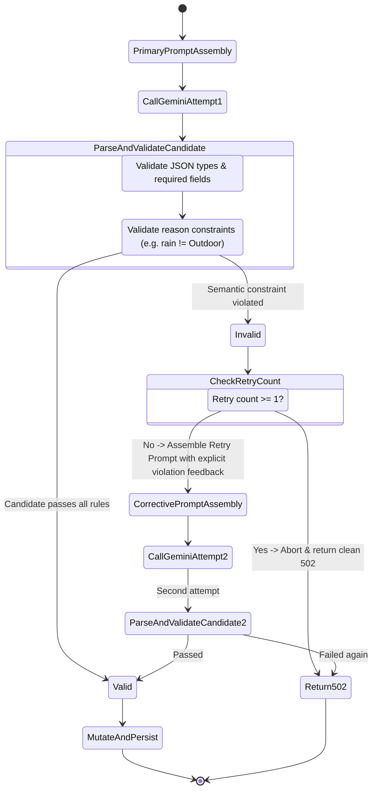

# TRIPNOW: ADAPTIVE AI TRAVEL PLANNER
## Technical Requirements Document (TRD.md)

**Document Version:** 1.0.0  
**Target Environment:** Node.js (v18+) / Express 5 / MongoDB (Mongoose 8+) / React (Vite)  
**AI Integration:** `@google/genai` (v2.22.0) with Google Gemini (`gemini-3.6-flash`)  
**Architecture Doctrine:** Probabilistic AI Brain + Deterministic Backend Authority  

---

## 1. System Architecture & High-Level Design

### 1.1 Architectural Principle
```
+-------------------------------------------------------------+
|                     TRIPNOW CLIENT (Browser)                 |
|  - Renders UI / Accordions                                   |
|  - Triggers Pivot Actions                                    |
|  - ZERO authoritative state (sends only IDs & trigger codes) |
+-------------------------------------------------------------+
                              |
                              | HTTPS REST (Zero Trust)
                              v
+-------------------------------------------------------------+
|              TRIPNOW BACKEND (Express / Node.js)            |
|  - Authentication & Ownership Verification                  |
|  - Authoritative Trip Loading (from MongoDB)                |
|  - Gemini Prompt Orchestration & Context Injection          |
|  - Deterministic Constraint Validation                      |
|  - Defensive Single-Retry Loop                              |
|  - Optimistic Concurrency Control (Version Checking)        |
|  - Surgical Block Mutation                                  |
+-------------------------------------------------------------+
           |                                     |
           | Mongoose ORM                        | SDK (@google/genai)
           v                                     v
+-----------------------+              +-----------------------+
|   MONGODB ATLAS / DB  |              |   GOOGLE GEMINI API   |
| - Booking Collection  |              | - gemini-3.6-flash    |
| - User Collection     |              | - Structured JSON     |
| - Atomic Persistence  |              | - Candidate Generator |
+-----------------------+              +-----------------------+
```

### 1.2 The Division of Responsibilities

| Responsibility | Owning Component | Justification |
| :--- | :--- | :--- |
| **Authentication & Identity** | Backend (`protect`, `optionalAuth`) | Token verification via `JWT_SECRET`. |
| **Trip Ownership Verification** | Backend (`Booking.findOne`) | Prevents User A from mutating User B's itinerary. |
| **Trip Context & Itinerary State** | Backend (MongoDB `Booking`) | Ground truth. Never trust client-provided budget or days. |
| **Creative Replacement Ideation** | Google Gemini (`@google/genai`) | Probabilistic brain excels at semantic alternatives. |
| **Semantic Constraint Enforcement** | Backend (`pivotValidator.js`) | Deterministic check (e.g. Rain candidate cannot be outdoor). |
| **Mutation Integrity & Persistence** | Backend (`Booking.save()`) | Only modifies the targeted block. Atomic database write. |
| **Concurrency & Duplicate Lock** | Frontend + Backend (`__v`) | Prevents double-taps and stale write overwrites. |

---

## 2. Current vs. Target Data Models

### 2.1 Current Schema (Phase 1 Baseline)
In the existing codebase (`backend/models/Booking.js`), trips are saved with an unstructured `aiPlan` field containing stringified or mixed JSON.

```javascript
// Current Booking Schema (backend/models/Booking.js)
const bookingSchema = new mongoose.Schema(
  {
    user:        { type: mongoose.Schema.Types.ObjectId, ref: "User", default: null, index: true },
    destination: { type: String, required: true, trim: true },
    guests:      { type: Number, required: true, min: 1 },
    checkin:     { type: Date, required: true },
    checkout:    { type: Date, required: true },
    budget:      { type: String, default: null },
    fullName:    { type: String, trim: true },
    email:       { type: String, trim: true },
    phone:       { type: String, trim: true },
    notes:       { type: String, default: null },
    dayCount:    { type: Number, default: 0 },
    tripData:    { type: mongoose.Schema.Types.Mixed, default: null },
    aiPlan:      { type: mongoose.Schema.Types.Mixed, default: null }, // Stores JSON Itinerary
  },
  { timestamps: true } // Provides createdAt, updatedAt, and __v (versionKey)
);
```

#### Ground-Truth Structure of `aiPlan` (JSON Object / String)
```json
{
  "destination": "Goa, India",
  "days": [
    {
      "day": 1,
      "title": "Old Goa & Heritage Churches",
      "morning": "Explore Basilica of Bom Jesus and Se Cathedral.",
      "afternoon": "Visit the Archaeological Museum and enjoy local Goan thali.",
      "evening": "Sunset cruise on the Mandovi River with traditional dance.",
      "food": ["Goan fish curry at Viva Panjim", "Bebinca dessert"]
    },
    {
      "day": 2,
      "title": "North Goa Beaches & Coastal Vibe",
      "morning": "Morning surf lesson at Morjim Beach.",
      "afternoon": "Relax at Baga Beach and try water sports.",
      "evening": "Dinner at beachfront cafe in Anjuna.",
      "food": ["Prawn balchão at Curlies"]
    }
  ],
  "mustEat": ["Goan Prawn Balchão", "Pork Vindaloo"],
  "budgetBreakdown": {
    "accommodation": "₹3,500/night",
    "foodPerDay": "₹1,200",
    "transport": "₹600",
    "activities": "₹1,000",
    "total": "₹21,000"
  },
  "travelTips": ["Rent a two-wheeler for easy mobility."],
  "whereToStay": { "budget": "Zostel Goa", "midRange": "Fairfield Goa" },
  "bestTimeToVisit": "November to February"
}
```

> [!IMPORTANT]
> **Phase 1 Rule:** The Adaptive Pivot Engine operates strictly on this block-level structure (`morning`, `afternoon`, `evening`). It does **not** assume coordinates or activity IDs.

### 2.2 Future Schema (Planned Phase 2: Structured Activity Migration)
For future phases (Reality Engine, Haversine routing), the schema will cleanly migrate to discrete activities:
```typescript
interface StructuredActivity {
  id: string; // e.g. "act_d2_aft_01"
  period: "morning" | "afternoon" | "evening";
  title: string;
  description: string;
  category: "Sightseeing" | "Dining" | "Adventure" | "Culture" | "Relaxation";
  indoorOutdoor: "Indoor" | "Outdoor" | "Mixed";
  durationMinutes: number;
  costEstimate: number;
  location: {
    name: string;
    lat?: number;
    lng?: number;
    address?: string;
  };
  isLocked: boolean; // Protects against replanning
}
```

---

## 3. API Contract Specifications

### 3.1 Preserved Baseline: `POST /api/ai`
Existing endpoint must remain 100% backward compatible:
- **Route:** `POST /api/ai`
- **Middleware:** `aiLimiter`, `optionalAuth`, `validate(aiTripSchema)`
- **Request Payload:**
  ```json
  {
    "destination": "Lisbon, Portugal",
    "budget": "40000",
    "startDate": "2026-10-01",
    "endDate": "2026-10-04"
  }
  ```
- **Response Payload (HTTP 200):**
  ```json
  {
    "success": true,
    "data": "{\"destination\":\"Lisbon, Portugal\",\"days\":[...]}",
    "tripId": "664a78bc9d2e1f4a9c801234"
  }
  ```

---

### 3.2 New Endpoint: `POST /api/ai/pivot` (Phase 1 Scope)

#### Route Registration
- **Path:** `/api/ai/pivot`
- **Method:** `POST`
- **Middleware Chain:**
  1. `aiLimiter` (Rate limiting: 20 req / 15 min per IP)
  2. `optionalAuth` / `protect` (Identity extraction via Bearer JWT)
  3. `validate(pivotRequestSchema)` (Zod request validation)
  4. `handlePivotRequest` (Controller)

#### Request Headers
| Header | Required | Description |
| :--- | :--- | :--- |
| `Content-Type` | Yes | `application/json` |
| `Authorization` | Conditional | `Bearer <JWT_TOKEN>` (required if trip belongs to authenticated user) |
| `Idempotency-Key`| Optional | UUID v4 generated by client to prevent replay double-posts |

#### Request Body Schema (Zero-Trust)
```json
{
  "tripId": "664a78bc9d2e1f4a9c801234",
  "dayNumber": 2,
  "block": "afternoon",
  "pivotReason": "rain",
  "customReason": null
}
```

##### Field Constraints:
- `tripId`: Required MongoDB ObjectId string (24 hex characters).
- `dayNumber`: Required positive integer ($\ge 1$).
- `block`: Required enum: `"morning" | "afternoon" | "evening"`.
- `pivotReason`: Required enum: `"rain" | "low_energy" | "budget" | "running_late" | "closed" | "custom"`.
- `customReason`: String (1–300 characters). Required if `pivotReason === "custom"`; otherwise rejected or ignored.

---

#### Response Contract (HTTP 200 OK)
```json
{
  "success": true,
  "data": {
    "tripId": "664a78bc9d2e1f4a9c801234",
    "dayNumber": 2,
    "block": "afternoon",
    "pivotReason": "rain",
    "replacement": {
      "title": "National Tile Museum (Museu Nacional do Azulejo)",
      "description": "Explore the historic Madre de Deus Convent featuring centuries of ornate Portuguese decorative ceramic tiles, peaceful indoor cloisters, and an exquisite baroque chapel.",
      "category": "Culture & Museum",
      "indoorOutdoor": "Indoor",
      "estimatedDurationMinutes": 120,
      "costEstimate": "€5 - €8",
      "reason": "Completely sheltered from rainfall inside historic convent cloisters.",
      "insiderTip": "Visit the internal cafeteria courtyard garden for warm pastries and coffee."
    },
    "formattedBlock": "Visit the National Tile Museum (Museu Nacional do Azulejo) — explore centuries of ceramic tile art inside the historic Madre de Deus Convent cloisters."
  }
}
```

---

#### Error Response Matrix

| Status Code | Code / Reason | Example Client Message |
| :--- | :--- | :--- |
| **400 Bad Request** | Missing / invalid `tripId`, unsupported block, missing `customReason` | `"Validation error: 'block' must be one of: morning, afternoon, evening"` |
| **401 Unauthorized** | Trip requires authentication but token is missing / expired | `"Not authorized, token missing or invalid"` |
| **403 Forbidden** | User token valid, but trip belongs to another user account | `"You are not authorized to modify this trip"` |
| **404 Not Found** | `tripId` does not exist, or `dayNumber` exceeds itinerary days | `"Trip not found or specified day does not exist in itinerary"` |
| **409 Conflict** | Concurrency conflict: Document was modified by a concurrent request | `"Trip was modified in another session. Please refresh and try again."` |
| **429 Too Many Req** | Rate limit on AI service or IP exceeded | `"AI service rate limit reached. Please try again in a few moments."` |
| **502 Bad Gateway** | Gemini produced invalid candidate after defensive retry or service error | `"Unable to find a suitable replacement right now. Please try again."` |
| **504 Gateway Timeout**| Gemini API exceeded timeout threshold (10 seconds) | `"AI service request timed out. Please try again."` |

---

## 4. Google Gemini Integration Architecture

### 4.1 Client Initialization & SDK
The engine uses the official `@google/genai` JavaScript SDK (v2.22.0):
```javascript
const { GoogleGenAI, Type } = require("@google/genai");
const env = require("../config/env");

const ai = new GoogleGenAI({
  apiKey: env.geminiApiKey,
});
```

### 4.2 Pivot Candidate Response Schema
Gemini is constrained to emit JSON matching this schema:
```javascript
const pivotCandidateSchema = {
  type: Type.OBJECT,
  properties: {
    title: { type: Type.STRING },
    description: { type: Type.STRING },
    category: { type: Type.STRING },
    indoorOutdoor: { 
      type: Type.STRING, 
      enum: ["Indoor", "Outdoor", "Mixed"] 
    },
    estimatedDurationMinutes: { type: Type.INTEGER },
    costEstimate: { type: Type.STRING },
    reason: { type: Type.STRING },
    insiderTip: { type: Type.STRING },
  },
  required: [
    "title",
    "description",
    "category",
    "indoorOutdoor",
    "estimatedDurationMinutes",
    "costEstimate",
    "reason",
    "insiderTip",
  ],
};
```

---

## 5. Defensive Semantic Validation & Retry Engine

### 5.1 Deterministic Constraints
The backend evaluates the Gemini candidate against hardcoded business rules before allowing database persistence:

| Pivot Reason | Deterministic Validation Rules | Violated Condition |
| :--- | :--- | :--- |
| `rain` | Must be weatherproof | `candidate.indoorOutdoor === "Outdoor"` OR text contains outdoor keywords (beach, surf, open-air hike). |
| `low_energy` | Low physical strain | `candidate.estimatedDurationMinutes > 240` OR category is "Strenuous Trek". |
| `budget` | Low/free financial impact | Cost estimate indicates luxury/expensive activities. |
| `running_late`| Short duration | `candidate.estimatedDurationMinutes > 90`. |
| `closed` | Non-duplicate replacement | Replacement title matches or closely resembles the original activity title. |

### 5.2 Single Corrective Retry Execution Flow


#### Example Corrective Retry Prompt
```
The previous candidate violated the rain constraint because it was marked 'Outdoor' ("Surfing at Baga Beach").
CRITICAL RULE: The traveler is experiencing heavy rain.
Return ONLY an indoor or completely weather-resilient replacement (e.g. museum, gallery, covered market, cooking workshop).
Do NOT recommend beaches, open viewpoints, water sports, or outdoor gardens.
```

---

## 6. Concurrency Control & Mutation Integrity

### 6.1 Optimistic Concurrency Control (OCC)
To prevent lost updates from double clicks or concurrent browser tabs:
1. When loading the trip:
   ```javascript
   const trip = await Booking.findById(tripId);
   const currentVersion = trip.__v;
   ```
2. When performing the mutation:
   ```javascript
   const updatedItinerary = applySurgicalPivot(trip.aiPlan, dayNumber, block, replacement);
   
   const result = await Booking.findOneAndUpdate(
     { _id: tripId, __v: currentVersion },
     { 
       $set: { aiPlan: updatedItinerary },
       $inc: { __v: 1 } 
     },
     { new: true }
   );

   if (!result) {
     return res.status(409).json({
       success: false,
       message: "Conflict: Itinerary was modified by another request. Please refresh.",
     });
   }
   ```

### 6.2 Surgical Mutation Logic (`applySurgicalPivot`)
```javascript
function applySurgicalPivot(rawAiPlan, dayNumber, block, replacement) {
  const plan = typeof rawAiPlan === "string" ? JSON.parse(rawAiPlan) : JSON.parse(JSON.stringify(rawAiPlan));
  
  const dayIndex = plan.days.findIndex(d => d.day === Number(dayNumber));
  if (dayIndex === -1) throw new Error("Day not found in itinerary");

  // Format concise string for existing string-based UI compatibility
  const formattedText = `${replacement.title} — ${replacement.description}`;
  
  // Mutate ONLY the designated block
  plan.days[dayIndex][block] = formattedText;
  
  // Return updated plan in same format as original
  return typeof rawAiPlan === "string" ? JSON.stringify(plan) : plan;
}
```

---

## 7. Security & Zero-Trust Checklist

- [x] **Zero Client Authority:** Client cannot pass modified `destination`, `budget`, or existing days to influence the pivot.
- [x] **Ownership Check:** If `trip.user` exists, verify `req.user?._id.equals(trip.user)`. Reject unauthorized users with HTTP 403.
- [x] **Rate Limiting:** `aiLimiter` restricts IP to 20 requests per 15-minute window.
- [x] **Prompt Injection Defense:** `customReason` validated via Zod: `.trim().min(1).max(300)` and stripped of prompt delimiter hacks.
- [x] **Secret Isolation:** `GEMINI_API_KEY` accessed solely through `env.js`; never logged or returned in error payloads.
- [x] **Safe Logging:** Server logs never include JWTs, authorization headers, or full sensitive trip payloads.

---

## 8. Test Strategy & Mocking Architecture

### 8.1 Zero Real-API Quota Consumption in CI/CD
Automated Jest tests must never invoke the live Google Gemini API. The boundary is mocked using Jest module mocks:
```javascript
jest.mock("@google/genai", () => {
  const original = jest.requireActual("@google/genai");
  return {
    ...original,
    GoogleGenAI: jest.fn().mockImplementation(() => ({
      models: {
        generateContent: jest.fn(),
      },
    })),
  };
});
```

### 8.2 Comprehensive Test Scenarios for `POST /api/ai/pivot`
1. **Happy Path:**
   - Rain pivot succeeds and persists.
   - Low energy pivot succeeds.
   - Budget pivot succeeds.
   - Running late pivot succeeds.
   - Closed venue pivot succeeds.
   - Custom reason pivot succeeds.
2. **Defensive Retry Mechanics:**
   - First attempt produces Outdoor candidate during Rain pivot $\rightarrow$ Backend triggers retry with corrective instruction $\rightarrow$ Second attempt returns Indoor candidate $\rightarrow$ Success HTTP 200.
   - First attempt produces Outdoor candidate $\rightarrow$ Second attempt also produces Outdoor candidate $\rightarrow$ Backend returns HTTP 502 with friendly error message without persisting invalid state.
3. **Security & Validation:**
   - Missing or malformed `tripId` $\rightarrow$ 400.
   - Invalid `block` (e.g. `"midnight"`) $\rightarrow$ 400.
   - Invalid `pivotReason` $\rightarrow$ 400.
   - `pivotReason === "custom"` with missing `customReason` $\rightarrow$ 400.
   - Non-existent `tripId` $\rightarrow$ 404.
   - User B attempting to pivot User A's private trip $\rightarrow$ 403.
4. **Data Integrity & Immutability:**
   - Assert Day 1, Day 2 Morning, Day 2 Evening, and Day 3 remain bit-for-bit identical before and after Day 2 Afternoon pivot.
5. **Concurrency & Upstream Resilience:**
   - Stale version write attempt $\rightarrow$ HTTP 409 Conflict.
   - Gemini 429 quota exhaustion $\rightarrow$ HTTP 429.
   - Gemini connection timeout ($> 10\text{s}$) $\rightarrow$ HTTP 504.

---

## 9. Phase 4 Technical Specification — Fix My Day

### 9.1 Endpoints Overview
1. `POST /api/ai/fix-day/preview`: Diagnoses day, requests candidate adaptation, verifies via Reality Engine, signs proposal token with `FIX_DAY_PROPOSAL_SECRET`, returns non-persisted preview diff.
2. `POST /api/ai/fix-day/apply`: Accepts signed proposal token, cryptographically verifies token and claims *before* DB lookup, validates OCC version and fresh DB state, atomically applies mutation, and recalculates Reality Score.

### 9.2 Request & Response Contracts

#### 9.2.1 Preview Request Body
```json
{
  "tripId": "664a78bc9d2e1f4a9c801234",
  "dayNumber": 2,
  "reason": "running_late",
  "currentPeriod": "afternoon",
  "delayMinutes": 60,
  "customReason": null
}
```
- `tripId`: Required 24-character hex string.
- `dayNumber`: Required positive integer ($\ge 1$).
- `reason`: Required enum: `"schedule_overload" | "running_late" | "custom"`.
- `currentPeriod`: Required enum: `"morning" | "afternoon" | "evening"` if `reason === "running_late"`; otherwise optional.
  - Periods prior to `currentPeriod` are immutable past (`COMPLETED_PAST`).
  - `currentPeriod` is immutable in Phase 4 MVP regardless of lock state (uncompleted minutes are unknown without telemetry).
  - Only eligible future unlocked periods after `currentPeriod` may be adapted.
  - If future unlocked capacity cannot safely absorb `delayMinutes`, returns HTTP 422 with zero DB mutation.
- `delayMinutes`: Required positive integer between 15 and 240 if `reason === "running_late"`; otherwise rejected or null.
- `customReason`: String 1–300 characters if `reason === "custom"`; otherwise null.

#### 9.2.2 Preview Response Body (HTTP 200)
```json
{
  "success": true,
  "data": {
    "tripId": "664a78bc9d2e1f4a9c801234",
    "dayNumber": 2,
    "baseVersion": 2,
    "proposalToken": "<HMAC_SHA256_SIGNED_TOKEN_PURPOSE_FIX_DAY>",
    "proposalId": "prop_664a78bc_d2_1773581100000",
    "issuedAt": 1773581100000,
    "expiresAt": 1773582000000,
    "diagnosis": {
      "beforeActiveMinutes": 620,
      "targetActiveMinutes": 450,
      "issuesAddressed": ["iss-time-overload-2"],
      "lockedAnchorsCount": 1
    },
    "scoreDelta": {
      "scoreBefore": 64,
      "scoreAfter": 86,
      "statusBefore": "RISKY",
      "statusAfter": "EXCELLENT",
      "timeSubScoreBefore": 46,
      "timeSubScoreAfter": 92
    },
    "slots": [
      {
        "period": "morning",
        "action": "COMPLETED_PAST",
        "isLocked": false,
        "activity": { "id": "d2-morning-01", "title": "Pastéis de Belém Cafe", "durationMinutes": 90 }
      },
      {
        "period": "afternoon",
        "action": "CURRENT_IN_PROGRESS",
        "isLocked": false,
        "activity": { "id": "d2-afternoon-01", "title": "Pena Palace Visit", "durationMinutes": 240 }
      },
      {
        "period": "evening",
        "action": "REPLACED",
        "isLocked": false,
        "originalActivity": { "id": "d2-evening-01", "title": "Late Night River Cruise & Dinner", "durationMinutes": 210 },
        "replacementActivity": {
          "id": "d2-evening-01",
          "title": "Bairro Alto Traditional Dinner",
          "description": "Relaxing dinner at a local taverna in historic Bairro Alto.",
          "category": "Dining & Nightlife",
          "indoorOutdoor": "Indoor",
          "durationMinutes": 90,
          "cost": "€25",
          "reason": "Compacted evening by 120m to absorb the 60m afternoon delay."
        }
      }
    ]
  }
}
```

#### 9.2.3 Apply Request Body (Zero Client Payload Authority)
```json
{
  "tripId": "664a78bc9d2e1f4a9c801234",
  "dayNumber": 2,
  "proposalToken": "<HMAC_SHA256_SIGNED_TOKEN>"
}
```
*Note: `tripId` and `dayNumber` in the request body serve as redundant sanity cross-checks against token claims (`token.tripId` and `token.dayNumber`). The signed token claims remain strictly authoritative. The client submits ZERO replacement activity content, duration, costs, or lock states.*

#### 9.2.4 Apply Response Body (HTTP 200)
```json
{
  "success": true,
  "data": {
    "tripId": "664a78bc9d2e1f4a9c801234",
    "version": 3,
    "dayNumber": 2,
    "updatedDay": { ... },
    "realityReport": { ... }
  }
}
```

### 9.3 Proposal Integrity & Token Specification
- **Algorithm**: HMAC-SHA256 using dedicated server secret `FIX_DAY_PROPOSAL_SECRET`.
- **Payload Claims Schema**:
  ```json
  {
    "purpose": "fix-day",
    "proposalId": "550e8400-e29b-41d4-a716-446655440000",
    "tripId": "664a78bc9d2e1f4a9c801234",
    "dayNumber": 2,
    "baseVersion": 2,
    "reason": "running_late",
    "currentPeriod": "afternoon",
    "delayMinutes": 60,
    "replacementSlots": [
      {
        "targetActivityId": "d2-evening-01",
        "replacement": {
          "id": "d2-evening-01",
          "period": "evening",
          "title": "Bairro Alto Traditional Dinner",
          "description": "Relaxing dinner at a local taverna.",
          "category": "Dining & Nightlife",
          "indoorOutdoor": "Indoor",
          "durationMinutes": 90,
          "cost": "€25",
          "reason": "Compacted evening to absorb delay."
        }
      }
    ],
    "issuedAt": 1773581100000,
    "expiresAt": 1773582000000
  }
  ```
  *(For `schedule_overload` and `custom`, `currentPeriod: null` and `delayMinutes: null`)*
- **Token Claim Validation Rules**:
  - `purpose`: String, must be strictly `"fix-day"`.
  - `proposalId`: Valid UUID v4 string (strictly for lifecycle tracing/debugging; does not replace HMAC).
  - `tripId`: 24-hex MongoDB ObjectId string.
  - `dayNumber`: Positive integer ($\ge 1$).
  - `baseVersion`: Non-negative integer ($\ge 0$).
  - `reason`: Enum `"schedule_overload" | "running_late" | "custom"`.
  - `currentPeriod`: Enum `"morning" | "afternoon" | "evening"` or `null`.
  - `delayMinutes`: Integer $\in [15, 240]$ or `null`.
  - `issuedAt`: Integer Unix epoch milliseconds.
  - `expiresAt`: Integer Unix epoch milliseconds, enforcing:
    $$\text{expiresAt} > \text{issuedAt} \quad \text{and} \quad (\text{expiresAt} - \text{issuedAt}) \le 900000 \text{ (15 minutes)}$$
- **Client Non-Authority**: The client can never alter `reason`, `currentPeriod`, `delayMinutes`, `baseVersion`, or `replacementSlots`. Apply verifies all claims directly against the token before usage.
- **Environment Configuration**: `FIX_DAY_PROPOSAL_SECRET` must be set in environment. In production, missing secret causes startup failure (`throw Error`). In dev/test, falls back to a deterministic isolated secret with console warning.
- **Verification Boundary**: The system operates with a server-authoritative verification boundary; no client math, durations, or lock states are trusted.
- **Performance Benchmark Standard**: Reality Engine is currently implemented as deterministic in-memory JavaScript computation without external API calls. Performance must be measured through automated benchmarking and must not be assumed.

### 9.4 Replacement Targeting & Identity Invariants
To eliminate ambiguity when periods contain multiple activities:
1. `targetActivityId` MUST already exist in the authoritative fresh DB itinerary.
2. `targetActivityId` MUST belong to the requested day (`dayNumber`).
3. For `running_late`, `targetActivityId` MUST belong to an upcoming period strictly after `currentPeriod`.
4. `targetActivityId` MUST be unlocked (`locked === false`).
5. `replacement.id` MUST strictly equal `targetActivityId` (inherits authoritative target ID; no `d${dayNumber}-${period}-01` universal override).
6. `replacement.period` MUST equal the existing target activity's period.
7. Gemini MUST NEVER invent activity IDs.
8. No new activities may be created.
9. Total activity count cannot increase.
10. Missing periods cannot be created (no inventing an evening if evening does not exist).
11. Existing non-target activities must remain 100% bit-for-bit unchanged.
12. Replacement strictly inherits the authoritative target activity ID.

### 9.5 Separated Feasibility & Verification Semantics
1. **Deterministically Impossible Capacity (Pre-Flight 422)**:
   - Server calculates:
     $$\text{AllowableFutureActiveMinutes} = \text{HardCeiling} (480\text{m}) - \text{delayMinutes} - \sum \text{PastScheduledActiveMinutes} - \text{CurrentScheduledActiveMinutes}$$
   - Pre-flight evaluates scheduled durations without assuming elapsed progress.
   - If unavoidable future/locked scheduled duration deterministically exceeds $\text{AllowableFutureActiveMinutes}$, OR if there are zero eligible future unlocked replacement targets, the server proves impossibility and returns **HTTP 422 Unprocessable Entity** (`code: "FUTURE_CAPACITY_INSUFFICIENT"`, message: `"Unavoidable scheduled duration exceeds allowable remaining capacity."`).
   - A mathematically feasible short future schedule (even under 60 minutes) is **not** automatically rejected if it satisfies all deterministic constraints.
2. **Candidate Rejected by Deterministic Verification (Post-Generation 502)**:
   - If a generated candidate fails constraints after the single corrective retry, the server returns **HTTP 502 Bad Gateway** (`code: "PROPOSAL_VALIDATION_FAILED"`, message: `"Unable to generate a valid adaptation proposal that satisfies all constraints. Please adjust activities manually."`).
   - This does NOT claim mathematical impossibility of all potential schedules; it accurately reports that the AI proposal attempt failed deterministic verification.

### 9.6 Category Contract Inheritance
Candidate schema strictly enforces the existing Phase 2 StructuredActivity categories:
`["Sightseeing", "Culture", "Adventure", "Dining & Nightlife", "Relaxation", "Nature", "Shopping"]`.
Any candidate proposing a category outside this 7-item set is rejected during semantic validation.

### 9.7 Locked-Anchor Deep Immutability
"Bit-for-bit immutable" is evaluated by deep-comparing the complete locked activity structure:
`id`, `period`, `title`, `description`, `category`, `durationMinutes`, `cost`, `indoorOutdoor`, `location` (including nested `name`, `lat`, `lng`), and `locked`.
Zero fields may change. If any field differs or a locked activity is omitted, candidate validation fails immediately.

`id`, `period`, `title`, `description`, `category`, `durationMinutes`, `cost`, `indoorOutdoor`, `location` (including nested `name`, `lat`, `lng`), and `locked`.
Zero fields may change. If any field differs or a locked activity is omitted, candidate validation fails immediately.

### 9.7 Budget Unknown-Data Policy
1. **No Invented Costs**: Unknown prose ("Moderate", "Varies") and "Free" ($0) are parsed deterministically; numbers are never invented.
2. **Deficit Taxonomy**:
   - *Existing Deficit*: Trip was already over activity budget ceiling before adaptation. Permitted to stand if not worsened.
   - *Newly Introduced Deficit*: Trip was under budget, but candidate pushes cost over ceiling. **Strict Rejection**.
   - *Worsened Deficit*: Candidate increases an existing budget deficit ($\Delta_{\text{after}} > \Delta_{\text{before}}$). **Strict Rejection**.
   - *10% Non-Inflation*: Where before/after numeric costs are known, Day $X$ known activity cost must satisfy $C_{\text{after}} \le C_{\text{before}} \times 1.10$.

### 9.8 Missing Legacy Slot Handling
If a legacy day contains fewer than 2 activities or zero adaptable slots, the engine does NOT invent missing periods. It returns HTTP 422 (`"Cannot adapt Day X: Day contains insufficient adaptable slots."`).

### 9.9 Apply Transaction Sequence
1. **Cryptographic Token Verification (Pre-DB)**:
   - Verify HMAC-SHA256 signature with `FIX_DAY_PROPOSAL_SECRET`.
   - Verify `token.purpose === "fix-day"` (fail 400 if wrong purpose).
   - Verify `Date.now() <= token.expiresAt` (fail 410 if expired).
   - Verify `token.tripId === req.body.tripId` and `token.dayNumber === req.body.dayNumber` (fail 400 if mismatch).
2. **Fresh MongoDB Fetch & Authorization**:
   - Load trip by `token.tripId`.
   - Verify ownership (`callerId === trip.user.toString()` if `trip.user` exists).
3. **OCC Version Match**:
   - Verify `trip.__v === token.baseVersion` (fail 409 if stale).
4. **Candidate Reconstruction & Deep Invariants**:
   - Unpack `token.replacementSlots` onto fresh plan.
   - Deep-compare all locked activities on Day $X$ between fresh DB and reconstructed plan.
   - Verify all 5 acceptance rules via `evaluateTripReality(reconstructedTrip)`.
5. **Atomic OCC Update**:
   - `Booking.findOneAndUpdate({ _id: tripId, __v: token.baseVersion }, { $set: { aiPlan }, $inc: { __v: 1 } })`.
   - Fail 409 if conflict.
6. **Final Reality Recalculation**:
   - Run `evaluateTripReality` on persisted trip. Return HTTP 200.
